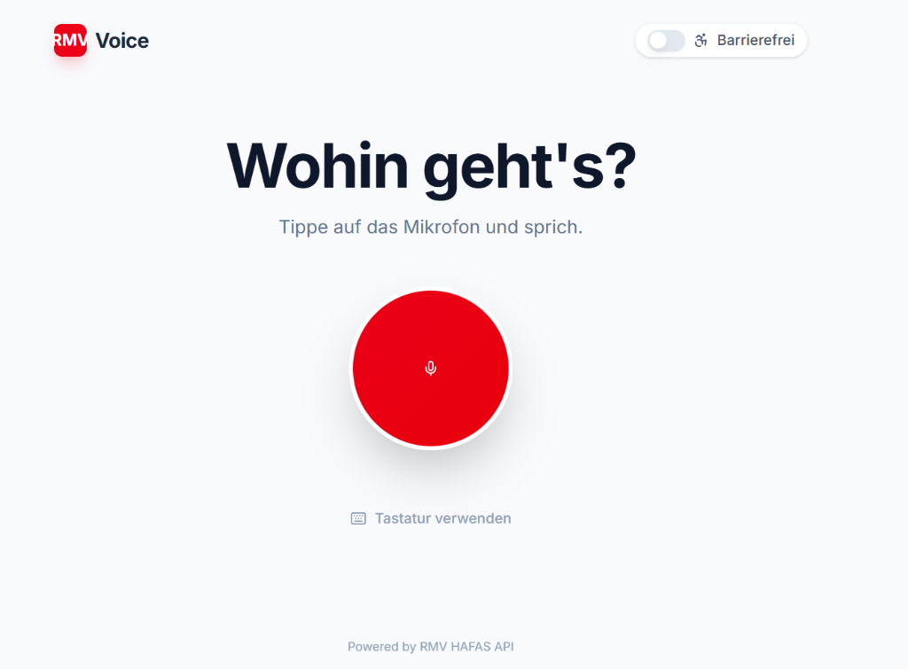

# 🎙️ RMV Voice

**Voice-First Public Transport Assistant for the Rhine-Main Area**

[](https://rmv-fines.vercel.app/)
[](https://www.typescriptlang.org/)
[](https://reactjs.org/)
[](https://vercel.com)



## ✨ Features

- 🎤 **Voice-First Interface** - Natural language trip planning in German
- 🗺️ **Smart Location Detection** - Automatic GPS-based station finding
- ⏱️ **Time-Aware Search** - "in 10 Minuten" or "um 14 Uhr" support
- ♿ **Accessibility Mode** - Wheelchair-friendly route options
- 🚉 **Detailed Trip Info** - Platform numbers, stopovers, and walking distances
- 🔒 **Smart Permission Handling** - Friendly guidance for mic/GPS access
- 📱 **Responsive Design** - Works on desktop and mobile

## 🚀 Quick Start

### Prerequisites

- Node.js 18+ 
- npm or yarn

### Installation

```bash
# Clone the repository
git clone https://github.com/yourusername/RMVFines.git
cd RMVFines

# Install dependencies
npm install

# Start development server
npm run dev
```

The app will be available at `http://localhost:5000`

### Environment Variables

Create a `.env` file in the root directory:

```env
# No API key required - uses public HAFAS API
NODE_ENV=development
```

## 🏗️ Tech Stack

### Frontend
- **React** - UI framework
- **TypeScript** - Type safety
- **Tailwind CSS** - Styling
- **Radix UI** - Accessible components
- **Web Speech API** - Voice recognition & synthesis

### Backend
- **Express** - API server
- **HAFAS Client** - Public transport data via `v6.db.transport.rest`
- **Vercel** - Serverless deployment

## 📖 Usage

1. **Click the microphone** or tap "Tastatur verwenden" for text input
2. **Say your destination**: 
   - "Nach Frankfurt"
   - "Von Mainz nach Wiesbaden"
   - "Hier nach Darmstadt in 20 Minuten"
3. **View results** with detailed timelines, platforms, and connections
4. **Expand trips** to see stopovers and walking segments

### Example Voice Commands

```
"Nach Frankfurt Hauptbahnhof"
"Von Wiesbaden nach Mainz um 14 Uhr"
"Hier nach Darmstadt in 10 Minuten"
"Frankfurt Airport nach Hauptbahnhof"
```

## 🛠️ Development

### Project Structure

```
RMVFines/
├── client/               # React frontend
│   ├── src/
│   │   ├── components/  # UI components
│   │   ├── hooks/       # Custom React hooks
│   │   ├── lib/         # Utilities & API client
│   │   └── pages/       # Page components
├── server/              # Express backend (local dev)
├── api/                 # Vercel serverless functions
└── dist/                # Build output
```

### Available Scripts

```bash
npm run dev          # Start development server
npm run build        # Build for production
npm run preview      # Preview production build
npm run check        # Type checking
```

## 🌐 API

The app uses the public HAFAS API (`v6.db.transport.rest`) for:
- Location search
- Nearby station detection
- Journey planning with real-time data

No API key required! 🎉

## 📱 Deployment

Automatically deploys to Vercel on push to `main`:

```bash
git push origin main
```

Or deploy manually:

```bash
vercel --prod
```

## 🤝 Contributing

Contributions are welcome! Please feel free to submit a Pull Request.

1. Fork the repository
2. Create your feature branch (`git checkout -b feature/AmazingFeature`)
3. Commit your changes (`git commit -m 'Add some AmazingFeature'`)
4. Push to the branch (`git push origin feature/AmazingFeature`)
5. Open a Pull Request

## 📄 License

This project is licensed under the MIT License - see the [LICENSE](LICENSE) file for details.

## 🙏 Acknowledgments

- [HAFAS Client](https://github.com/public-transport/hafas-client) - Public transport API
- [RMV](https://www.rmv.de/) - Rhine-Main Transport Association
- [Radix UI](https://www.radix-ui.com/) - Accessible component primitives
- [Vercel](https://vercel.com) - Hosting & deployment

## 📧 Contact

Questions? Reach out via [GitHub Issues](https://github.com/yourusername/RMVFines/issues)

---

**Made with ❤️ for the Rhine-Main Area**

[Live Demo](https://rmv-fines.vercel.app/) • [Report Bug](https://github.com/yourusername/RMVFines/issues) • [Request Feature](https://github.com/yourusername/RMVFines/issues)
